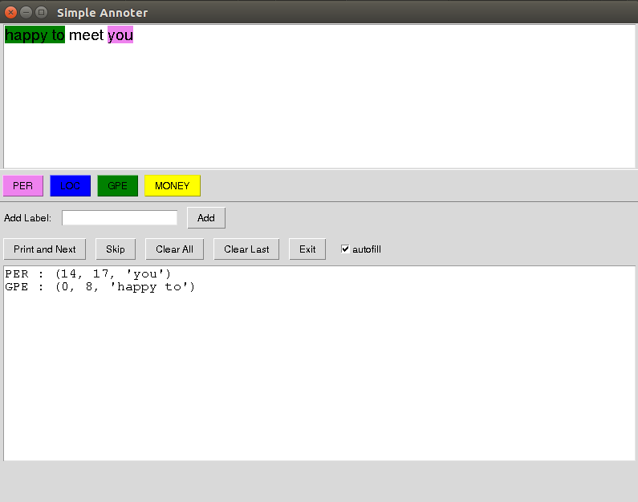

# SimpleAnnotator

This is simple GUI for annotating text, intended as input for e.g., NER training using spaCy.

I was unable to find a simple annotation tool that worked for me, so I spent a few days working on this, then a few more days adding features, and so on.
A motivating principle was keeping things simple, minimizing dependencies, so hopefully this works well for everyone. As a result, it not the prettiest app, though.

Currently this tool allows annotating input file line by line. Input and output files are specified on the command line (with flags `-i` and `-o` resp.). 
Labels can be predefined and added within the program (flag `-l`).

Text is annotated by highlighting a selection, then clicking a label button or right click.

If you use this let me know what you think. I am planning to implement file selection from withing the program. 
Also, I plan to modify this program to allow editing existing annotations, but that will require redesigning the logical structure pretty significantly, so I list that as future work.

